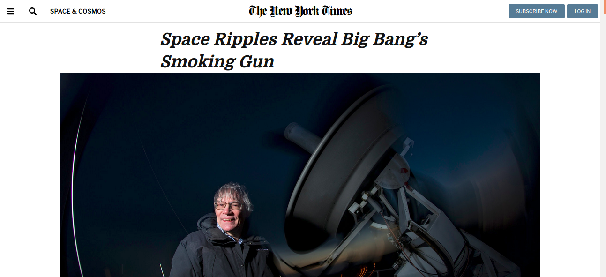

# NYT Clone

    This project consists of building an HTML document that matches the appearance of a New York Time article
    for learning purpose.

## :package: Built With

    - Plain HTML5
    - Pure CSS3

## :mag: Live Demo

[Live Demo Link](https://mcervantes71.github.io/NYT_Clone1/index.html)

## :busts_in_silhouette: Authors

👤 **Author1**

- Github: [@mcervantes71](https://github.com/mcervantes71)
- Twitter: [@M4rt1nC3rv4nt3s](https://twitter.com/M4rt1nC3rv4nt3s)
- Linkedin: [Martin Cervantes](https://www.linkedin.com/in/cervantesmartin/)

👤 **Author2**

* Github: [@rindrajosia](https://github.com/rindrajosia)
* Twitter: [@rindrajosia](https://twitter.com/josia_rindra)
* Linkedin: [linkedin](https://www.linkedin.com/in/rindra-josia-99b2111a2/)

## 🤝 Contributing

    Contributions, issues and feature requests are welcome!

Feel free to check the [issues page](issues/).

## :star2: Show your support

    Give a ⭐️ if you like this project!

## 📝 License

This project is [MIT](lic.url) licensed.
